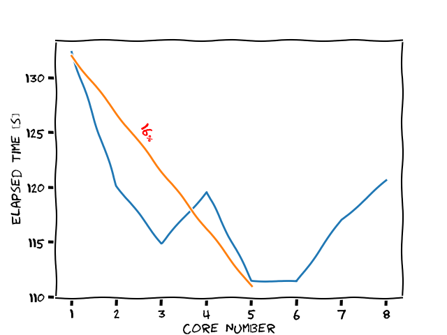

# fastpredict

This python library is extended, optimized, and more flexible version of lazypredict library. Fastpredict support multiprocessing that will up your speed during training stage like seen in figure 1. You don't need to train the models for each test, you can test trained models whenever you want after one times training. There is no need to evaluate the model with desired metrics, just give the metrics fatpredict evaluation function. There are plenty of features of fastpredict library, feel free to explore them.

# Installation

To install Lazy Predict:

    pip install lazypredict

# Usage

```python
import fastpredict.classification
import sklearn.datasets
import sklearn.model_selection
data = sklearn.datasets.load_iris()
X = data.data
y= data.target

X_train, X_test, y_train, y_test = sklearn.model_selection.train_test_split(X, y,test_size=.2,random_state =42)
fastpredict = fastpredict.classification.Fastpredict(n_core = 2, verbose =1)
fastpredict.fit(X_train, y_train)
preds = fastpredict.predict(X_test)
evaluation = fastpredict.evaluate(X_test)
evaluation = pandas.DataFrame(evaluation).T
print(evaluation)

                                accuracy_score  f1_score  precision_score  recall_score
AdaBoostClassifier                    1.000000  1.000000         1.000000      1.000000
BaggingClassifier                     1.000000  1.000000         1.000000      1.000000
BernoulliNB                           0.983333  0.980462         0.988095      0.973684
CalibratedClassifierCV                0.983333  0.980462         0.988095      0.973684
CategoricalNB                         0.766667  0.635417         0.872727      0.631579
ComplementNB                          0.991667  0.990303         0.993976      0.986842
DecisionTreeClassifier                1.000000  1.000000         1.000000      1.000000
DummyClassifier                       0.683333  0.405941         0.341667      0.500000
ExtraTreeClassifier                   1.000000  1.000000         1.000000      1.000000
ExtraTreesClassifier                  1.000000  1.000000         1.000000      1.000000
GaussianNB                            0.983333  0.981007         0.975000      0.987805
GaussianProcessClassifier             1.000000  1.000000         1.000000      1.000000
GradientBoostingClassifier            1.000000  1.000000         1.000000      1.000000
HistGradientBoostingClassifier        1.000000  1.000000         1.000000      1.000000
KNeighborsClassifier                  0.958333  0.949996         0.971264      0.934211
LabelPropagation                      1.000000  1.000000         1.000000      1.000000
LabelSpreading                        1.000000  1.000000         1.000000      1.000000
LinearDiscriminantAnalysis            0.991667  0.990303         0.993976      0.986842
LinearSVC                             1.000000  1.000000         1.000000      1.000000
LogisticRegression                    1.000000  1.000000         1.000000      1.000000
LogisticRegressionCV                  1.000000  1.000000         1.000000      1.000000
MLPClassifier                         1.000000  1.000000         1.000000      1.000000
MultinomialNB                         0.950000  0.939496         0.965909      0.921053
NearestCentroid                       0.950000  0.942234         0.942234      0.942234
NuSVC                                 0.975000  0.970470         0.982353      0.960526
OneVsOneClassifier                    1.000000  1.000000         1.000000      1.000000
OneVsRestClassifier                   0.991667  0.990303         0.993976      0.986842
OutputCodeClassifier                  1.000000  1.000000         1.000000      1.000000
PassiveAggressiveClassifier           1.000000  1.000000         1.000000      1.000000
Perceptron                            1.000000  1.000000         1.000000      1.000000
QuadraticDiscriminantAnalysis         1.000000  1.000000         1.000000      1.000000
RadiusNeighborsClassifier             1.000000  1.000000         1.000000      1.000000
RandomForestClassifier                1.000000  1.000000         1.000000      1.000000
RidgeClassifier                       0.991667  0.990303         0.993976      0.986842
RidgeClassifierCV                     0.991667  0.990303         0.993976      0.986842
SGDClassifier                         0.975000  0.970470         0.982353      0.960526
SVC                                   0.991667  0.990303         0.993976      0.986842
StackingClassifier                    1.000000  1.000000         1.000000      1.000000
VotingClassifier                      1.000000  1.000000         1.000000      1.000000


```

See examples/quick_start.py for details.

# Comparision


<table >
    <thead>
        <tr>
            <th> Feature </th>
            <th> Fastpredict </th>
            <th> Lazypredict </th>
        </tr>
    <thead>
    <tbody>
        <tr>
            <td align = 'center'> Multiprocessing</td>
            <td align = 'center'> ✔</td>
            <td align = 'center'> ❌</td>
        </tr>
        <tr>
            <td align = 'center'> Speed</td>
            <td align = 'center'> ⬆</td>
            <td align = 'center'>⬇</td>
        </tr>
        <tr>
            <td align = 'center'> Flexibility</td>
            <td align = 'center'> ⬆</td>
            <td align = 'center'>⬇</td>
        </tr>
        <tr>
            <td align = 'center'> Customization</td>
            <td align = 'center'> ⬆</td>
            <td align = 'center'>⬇</td>
        </tr>
        <tr>
            <td align = 'center'> Model numbers</td>
            <td align = 'center'> ⬆</td>
            <td align = 'center'>⬇</td>
        </tr>
    </tbody>

</table>

<p>
Using multiprocessing save our 16% time compared to single core. See the result in Figure 1
</p>

<table >
    <tbody>
        <tr>
            <td align = 'center'> </td>
        </tr>
        <tr>
            <td align = 'center' > Figure 1: Training time with respect to used core</td>
        </tr>
    </tbody>

</table>
